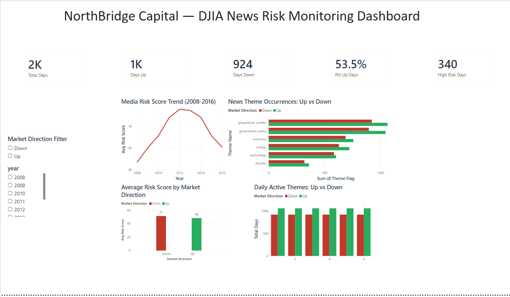

# 📊 DJIA News Sentiment & Risk Monitoring Dashboard

An end-to-end data analytics project that examines whether international news headlines can help investment analysts identify market risk patterns — combining **Python (EDA, NLP, sentiment analysis)**, **SQL (analytical queries)**, and **Power BI (executive dashboard)**.

> **Simulated client brief:** NorthBridge Capital, an investment management firm, wanted to know if 3 years of daily international news headlines could provide actionable insight to support their DJIA investment decisions — without building a complex predictive model.

---

## 🎯 Business Questions Answered

1. How do news characteristics differ between market up-days and down-days?
2. What news themes are most dominant before market movements?
3. Does news sentiment relate to market direction?
4. Are there specific words/themes that precede market downturns?
5. Can a simple, explainable daily risk indicator be built for analysts?
6. What additional insights were uncovered beyond the original questions?

Full findings, recommendations, and limitations are documented in [`business_report.md`](business_report.md).

---

## 🔑 Key Findings

- Simple sentiment polarity alone is **not** a statistically significant predictor of market direction (p=0.72).
- Of 6 major news themes tested, only **technology-related news** showed a statistically significant relationship with down-days (p=0.0033).
- The **number of simultaneously active news themes** per day is a significant signal (p=0.029) — thematic accumulation matters more than any single topic.
- A composite **Risk Score (0–100)** built from these validated signals shows a real, moderate difference between down-days (avg. 51.2) and up-days (avg. 48.1).
- Risk sentiment clusters over multi-year periods, peaking in 2012–2013 and declining through 2016.

---

## 🛠️ Tools & Methods

| Stage | Tools | Techniques |
|---|---|---|
| Data Cleaning | Python (pandas) | Regex text cleaning, missing value handling |
| EDA & NLP | Python (TextBlob, scipy) | Sentiment scoring, keyword-based theme tagging, t-tests, chi-square tests |
| Data Storage & Querying | MySQL | Aggregation, HAVING, CASE WHEN, subqueries, window functions (RANK) |
| Visualization | Power BI | DAX measures, unpivoted theme modeling, interactive dashboard |
| Statistical Validation | scipy.stats | Independent t-test, chi-square test of independence |

---

## 📁 Repository Structure

```
djia-news-risk-analysis/
├── data/                   # Raw and processed datasets
├── notebook/               # Python EDA & analysis notebook
├── sql/                    # SQL queries (djia_news_queries.sql)
├── powerbi/                # Power BI dashboard file (.pbix)
├── images/                 # Chart exports & dashboard screenshots
├── business_report.md      # Full insight, recommendation & limitations report
└── README.md
```

---

## 📈 Dashboard Preview



---

## ⚠️ Key Limitation

All relationships identified in this analysis are **correlational, not causal** — consistent with the client's own understanding that news coverage and market movement do not always share a direct cause-and-effect relationship. Full limitations are detailed in the business report.

---

## 👤 Author

**ramadhan-data** — Freelance Data Analyst (SQL · Python · Power BI · Excel)
[[Upwork Profile](https://www.upwork.com/freelancers/~0187a65ac23eb99490)](#) · [GitHub](https://github.com/ramadhan-data)
